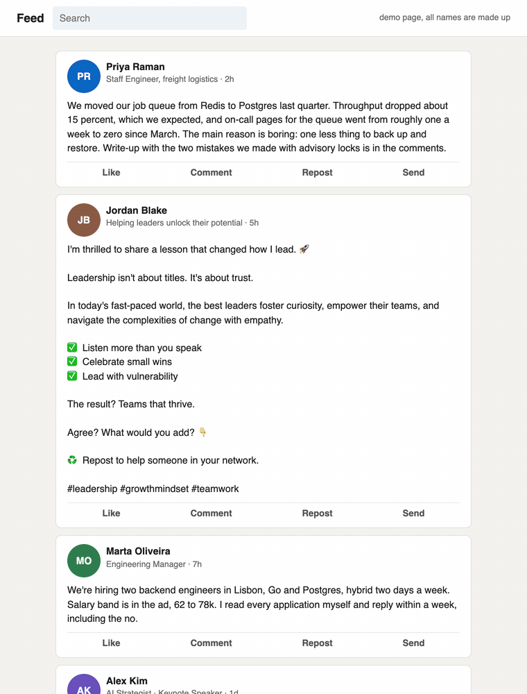

# slopblock

Adblock for AI slop. A browser extension that blurs AI-generated posts and articles in your feeds, runs entirely on your device, and tells you why it blurred each one.

On a held-out test set it blurred 57% of machine-written posts (80% when the prompt did not ask the model to hide its style) and 0 of 124 human posts, in a few milliseconds per post, with no model and no network.[^bench]

[](https://github.com/Arthur031221/slopblock/actions/workflows/ci.yml)
[](LICENSE)
[](CHANGELOG.md)



## Why

Feeds filled up with machine-written posts, and people are tired of it. Hacker News had five threads above 800 points about it in the two months from July 13 to September 11, 2026: [Ask HN: Add flag for AI-generated articles](https://news.ycombinator.com/item?id=48886741) (1102 points), [As AI eats the web, the internet's collective memory is disappearing](https://news.ycombinator.com/item?id=49250836) (938), [AI;DR](https://news.ycombinator.com/item?id=49336573) (1119), [Don't paste the AI, please](https://news.ycombinator.com/item?id=49371857) (1061) and [Ask HN: Can we please limit the AI news flood?](https://news.ycombinator.com/item?id=49657850) (868). [The load-bearing vocabulary of Claude](https://news.ycombinator.com/item?id=49461817) (710) showed the tells are measurable.

The existing tools either send your feed to a paid API, remove posts without telling you why, or block whole domains. slopblock works like an ad blocker instead: open lists you can edit, a verdict you can read, and nothing ever deleted. A blurred post is one click away.

- **Never deletes.** It blurs, folds long posts to a few lines, and shows a Show button.
- **Always shows the reason.** Every blurred item gets a strip with its score and its top three reasons, for example `AI 98` `Phrases: "in today's fast-paced"` `Template post` `Emoji bullets x4`.
- **Everything local.** No network requests, no analytics, no remote config. The extension pages run under a Content Security Policy with `connect-src 'none'`, and a test fails the build if network APIs appear in the source.
- **Your lists.** Add, remove and reweight words and phrases, import and export JSON.

## Install

**Chrome, Edge, Brave and other Chromium browsers.** Download [`slopblock-chrome-0.1.0.zip`](https://github.com/Arthur031221/slopblock/releases/download/v0.1.0/slopblock-chrome-0.1.0.zip), unzip it, open `chrome://extensions`, turn on Developer mode, click **Load unpacked** and pick the unzipped folder.

**Firefox 142 or later.** Download [`slopblock-firefox-0.1.0.zip`](https://github.com/Arthur031221/slopblock/releases/download/v0.1.0/slopblock-firefox-0.1.0.zip), open `about:debugging#/runtime/this-firefox`, click **Load Temporary Add-on** and pick the zip. Temporary add-ons are removed when Firefox restarts. A signed build on addons.mozilla.org is planned, see [Publishing](#publishing).

**From source** (Node 22.18 or later):

```sh
git clone https://github.com/Arthur031221/slopblock && cd slopblock && npm ci && npm run build
```

Then load `dist/chrome` (Chrome) or `dist/firefox/manifest.json` (Firefox) as above.

## Quick start

1. Install, then open [news.ycombinator.com](https://news.ycombinator.com), a Reddit thread, your LinkedIn feed or any blog post.
2. Items that score 50 or more are blurred with a reason strip. Hover to see through the blur, click the text or **Show** to read it, **Hide** to blur it again.
3. Click the toolbar icon for today's count, the sensitivity slider, per-site switches and **Pause on this site**.
4. Press **Alt+Shift+S** to turn everything off and on.
5. Want to know what it thinks of a text? Right-click the icon, **Options**, and paste it into **Try it**.

## How it works

Each site adapter finds posts and comments on the page, reads their text and author, and hands the text to a scoring engine. A `MutationObserver` picks up new items as you scroll. The engine is a set of pure functions in [`src/engine/`](src/engine), tested on their own, with no DOM and no extension APIs.

**1. Vocabulary.** An editable list of 354 weighted words and phrases in [`lists/vocabulary.json`](lists/vocabulary.json), built from three sources, each credited per entry:

- [The load-bearing vocabulary of Claude](https://louisabraham.github.io/load-bearing/) by Louis Abraham (MIT). His study of 461k GitHub pull request descriptions found one cluster of words go from 0.7 percent to 39 percent of the corpus. slopblock keeps the high-lift words that are rare in normal prose: `load-bearing`, `plainly`, `vacuously`, `byte-identical` and so on.
- [Wikipedia: Signs of AI writing](https://en.wikipedia.org/wiki/Wikipedia:Signs_of_AI_writing) (CC BY-SA 4.0), which tracks AI vocabulary by model era (`delve`, `tapestry`, `testament`, `showcasing`, `underscore`) and cites the studies behind it.
- Hand-collected marketing, LinkedIn engagement and chatbot phrases.

Words count anywhere. Openers ("Great question!") count only at the start, sign-offs ("Hope this helps!", "Agree?") only at the end. Chatbot leftovers ("As an AI language model", `utm_source=chatgpt.com`) settle it on their own.

**2. Structure.** Em dash density, negative parallelism ("it's not X, it's Y", "not just X but Y", "no X, no Y, just Z"), the rule of three and clipped triplets ("Fast. Simple. Private."), emoji bullets, Markdown headings and bold lead-ins in comments, bullet density, sentence length uniformity, hedging density, hashtag blocks, one-line paragraphs, and self-answered questions ("The result? Teams that thrive.").

**3. Site signals.** YouTube's "Altered or synthetic content" label, LinkedIn's AI-generated marker and Content Credentials on media, chatbot tracking tags on links, and engagement templates (two or more of "Agree?", "Repost", "Let that sink in", "Follow for more").

Points add up and map to a 0 to 100 score. Short texts are damped so one word in a one-line reply does not blur it. The default threshold of 50 was chosen on the dev half of the benchmark to keep false positives rare, because blurring a person costs more than missing a bot.

**4. No bundled classifier, yet.** An on-device classifier was in scope if one under 50 MB beat the heuristics on the benchmark. Three exist with ONNX weights that run in transformers.js, and all were scored on the same test half ([details](bench/results.md#optional-classifier)):

| Classifier | Size (q8) | Alone at 0.5: recall, human texts blurred | Added to the heuristic score: recall, human texts blurred |
|---|---|---|---|
| none (heuristics only) | 0 | | 57%, 0 of 124 |
| [trentmkelly/slop-detector-mini-2](https://huggingface.co/trentmkelly/slop-detector-mini-2) | 23 MB | 58%, 6 of 124 | 71%, 1 of 124 |
| [onnx-community/e5-small-lora-ai-generated-detector-ONNX](https://huggingface.co/onnx-community/e5-small-lora-ai-generated-detector-ONNX) | 34 MB | 95%, 84 of 124 | 63%, 0 of 124 |

The combination with slop-detector-mini-2 is a real gain: 11 more machine texts caught out of 79, for one more human text blurred. It is not in 0.1.0 because its weights are published without a license, so they cannot be redistributed in the extension, and slopblock will not download anything at runtime. The MIT-licensed e5 model is allowed, but its gain is 5 texts out of 79, which is within the noise of a set this size, and it costs 34 MB plus the ONNX runtime and about 50 ms per post on this laptop's CPU in Node. Heuristics only for now. The plan for 0.2 is an opt-in "import a model file" option, so you can load slop-detector-mini-2 yourself and nothing is fetched on your behalf.

## Benchmark

Full method, prompts, per-group numbers and the threshold curve are in [`bench/results.md`](bench/results.md). Run it yourself with `npm run bench`.

| Threshold | Precision | Recall | F1 | Human texts blurred |
|---|---|---|---|---|
| 30 | 85% | 72% | 0.78 | 10 of 124 |
| 40 | 93% | 67% | 0.78 | 4 of 124 |
| 50 (default) | 100% | 57% | 0.73 | 0 of 124 |
| 60 | 100% | 35% | 0.52 | 0 of 124 |

Numbers are from the held-out test half (79 machine, 124 human). Human side: 248 texts written before 2021 (Hacker News comments, Show HN and Ask HN posts) from the HN Algolia API with `numericFilters=created_at_i<1609459200`. Machine side: 160 Hacker News comments, LinkedIn posts, product blurbs and Reddit replies on 20 of the same topics, generated locally with Qwen3 4B and 1.7B through Ollama, half of them with a prompt that asks for plain text without Markdown, lists or emoji.

**The honest caveat:** the machine texts come from small local models, not from the frontier models that write most of the slop you actually see. Those write with fewer obvious tells, so expect lower recall in the wild. Treat the table as a regression test for the engine, not as a claim about the internet.

## Comparison

| Project | How it decides | Runs locally | Shows why | Sites | Cost |
|---|---|---|---|---|---|
| **slopblock** | Editable word lists, structure, platform labels | Yes, no network at all | Score and top reasons on every item | HN, X, LinkedIn, Reddit, YouTube, any article | Free, MIT |
| [adamnroman/slop-filter](https://github.com/adamnroman/slop-filter) | Sends post text to the Jev model through TypeSafe or OpenRouter and combines the answers into a score | No, post text goes to the API provider | A score on hover, plus account blocking | X, LinkedIn, Reddit, YouTube | Your own API key, about 4 cents per 1,000 posts by its README |
| [raduvlad92/AI-Slop-Blocker](https://github.com/raduvlad92/AI-Slop-Blocker) | You click to hide a video or channel, removes Google AI Overviews | Yes | No detection | YouTube, Google Search | Free, work in progress |
| [linkedin-slop-filter](https://github.com/jkesle/linkedin-slop-filter) and [jev-linkedin-slop-filter](https://github.com/Arpit-Khandelwal/jev-linkedin-slop-filter) | Userscript that removes elements, or the Jev API | Partly | No, or a stamp | LinkedIn | Free, or Jev API |
| [uBlockOrigin-HUGE-AI-Blocklist](https://github.com/laylavish/uBlockOrigin-HUGE-AI-Blocklist) | Hand-curated list of domains with AI imagery | Yes | No | Search results, whole domains | Free |
| [hcker.news](https://hcker.news/?ai=exclude) and [unslop.news](https://www.unslop.news/) | Hosted HN front pages that drop AI-related stories | No, hosted | No | HN front page | Free |

The hosted HN mirrors solve a different problem: they filter stories about AI, not machine-written text. They pair well with slopblock.

## Configuration

Everything lives in `chrome.storage.local` in your browser. Nothing syncs.

| Setting | Where | Default | What it does |
|---|---|---|---|
| On or off | Popup, **Alt+Shift+S** | On | Removes every blur when off |
| Blur at score | Popup slider | 50 | 10 to 95. Lower blurs more and misfires more |
| Sites | Popup | All on | Hacker News, X, LinkedIn, Reddit, YouTube, other sites (article mode) |
| Pause on this site | Popup | | Adds the current domain to the domain allowlist |
| Author allowlist | Options | Empty | Handles or names never blurred, case-insensitive, `@` and `u/` ignored |
| Domain allowlist | Options | Empty | Domains where slopblock does nothing, subdomains included |
| Hover preview | Options | On | Unblurs slightly while the pointer rests on an item |
| Word list | Options | Bundled list | Add, remove, reweight, import and export JSON, reset. Format in [docs/lists.md](docs/lists.md) |

Change the shortcut at `chrome://extensions/shortcuts` in Chrome or **Manage Extension Shortcuts** in Firefox's add-ons page.

Chat apps (ChatGPT, Claude, Gemini, Copilot, Perplexity, DeepSeek, Poe) and Gmail and Google Docs are excluded in the manifest, since blurring a chatbot's own answer or your own drafts helps nobody.

### Development

| Command | What it does |
|---|---|
| `npm run build` | Builds `dist/chrome` and `dist/firefox` and zips both into `dist/` |
| `npm run dev` | Rebuilds on save |
| `npm test` | Runs the vitest suite (engine, adapters against saved pages, scanner, settings, privacy checks) |
| `npm run lint` | biome and tsc |
| `npm run bench` | Scores `bench/data/` and rewrites `bench/results.md` |
| `npm run demo` | Rebuilds the screenshots and GIF in `demo/` from `demo/feed.html` in a sandboxed Chromium |

## Privacy

slopblock makes no network requests. It has no analytics, no telemetry, no remote configuration and no account. It asks for two permissions: `storage` for your settings and counters, and `activeTab` so the popup can read the current tab's hostname when you click it. The content script needs access to the pages it reads, which is why the browser shows "read and change data on all websites". Your lists, allowlists and counters stay in `chrome.storage.local` on your machine.

## Limits and FAQ

**It will misfire.** Detection is heuristic. People who write in a polished marketing voice, use em dashes, or post "Agree?" will get blurred sometimes. That is why it blurs instead of deleting, shows the reasons, and has an author allowlist.

**It will miss things.** A careful prompt ("write casually, no dashes, no lists") beats most of the tells. Frontier models are better at this than the small models in the benchmark. slopblock catches lazy slop, not every machine-written sentence.

**Why not a model?** See [How it works](#how-it-works). A classifier that does not beat a word list on the benchmark is extra megabytes and a black box, and it could not explain its verdict.

**Does it read my private messages?** It runs on every page you open, but only reads what the site adapters look for (posts, comments, article bodies), keeps nothing, and sends nothing anywhere. Gmail, Google Docs and chat apps are excluded.

**Can I share my list?** Export JSON from the options page and send the file. Importing validates it first.

**Why is a site not supported?** Sites change their markup often. Adapters are small, see [CONTRIBUTING.md](CONTRIBUTING.md). Any page with an article body still gets article mode.

### Publishing

To submit the Firefox build to addons.mozilla.org: run `npm run build`, sign in at the [Add-on Developer Hub](https://addons.mozilla.org/developers/), choose **Submit a New Add-on**, upload `dist/slopblock-firefox-0.1.0.zip`, and because the code is bundled, upload a source zip of the repository with these build steps. The manifest already declares a gecko id and `data_collection_permissions: none`. `npx web-ext lint --source-dir dist/firefox` reports no errors or warnings.

## Related projects

- [lenslocal](https://github.com/Arthur031221/lenslocal): Another on-device browser tool, camera translation instead of feed filtering, same no-network approach.
- [agentleaks](https://github.com/Arthur031221/agentleaks): Keeps your own AI-assisted work private the same way slopblock keeps your feed reading private, nothing leaves the machine.
- [installwall](https://github.com/Arthur031221/installwall): A different kind of on-device guard, checked before a package install instead of before a post renders.

## Contributing

Issues and pull requests are welcome, especially new site adapters, list entries with before and after benchmark numbers, and saved pages where slopblock gets it wrong. See [CONTRIBUTING.md](CONTRIBUTING.md).

## License

MIT, see [LICENSE](LICENSE). The default word list credits its sources in [docs/lists.md](docs/lists.md).

[^bench]: Test half of the slopblock benchmark, n = 203: 79 texts from Qwen3 4B and Qwen3 1.7B run locally in Ollama 0.34.4, and 124 Hacker News comments and posts written before 2021. Dev and test are split by a hash of each id, and weights were tuned on the dev half only. Default threshold 50. With zero false positives in 124, the 95% upper bound on the false positive rate is about 2.4%. Speed: the mean over all 408 texts was between 1.3 and 6.5 ms per text across runs in Node 26 on a MacBook Air M5 (24 GB) that was running other jobs, 2026-09-30. Method, prompts and the full curve: [bench/results.md](bench/results.md).
